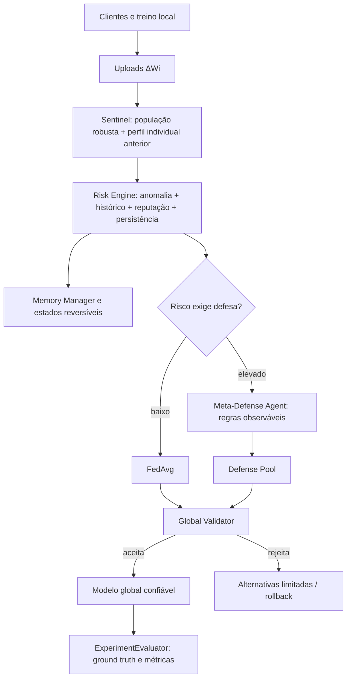

# FedMAD V2 — auditoria contínua, contexto individual e defesa adaptativa

## Problema científico e hipótese

Um update diferente da população não identifica, por si só, poisoning. Classes raras, poucos exemplos, drift e distribuições Non-IID podem produzir diferenças legítimas. A pergunta operacional é se o cliente mudou de modo incompatível com seu próprio histórico, descontando a dinâmica comum da rodada. A hipótese a investigar é que contexto populacional + histórico individual + reputação + persistência reduzam FPR sem deteriorar substancialmente TPR. Nenhuma superioridade científica é presumida por esta implementação.

## Phase 0: inventário antes de modificar código

Checkout local de `https://github.com/FialhoSJ/FedMAD.git`, revisão inicial `0cfeb15`; workspace inicialmente limpo. Não é necessário clonar novamente. Foram lidos o ponto de entrada, servidores FedAvg/FedMAD/base, clientes normal/malicioso/MAD, ataques, módulos MAD, leitores e geradores de dados, runners/analisadores, configurações, documentação e testes. A biblioteca contém vários algoritmos PFLlib não relacionados: continuam fora da migração.

Os sete testes de `tests/test_fedmad_redesign.py` passaram antes das mudanças. A simulação prévia MNIST/100 clientes/30 maliciosos/150 atualizações/seed 42 também permanece em `results/monza_article_replication/`. Seus parâmetros e resultados são da versão anterior; não são resultados V2. FedAvg precisou de avaliação final recuperada do checkpoint devido à falta de memória. A matriz de 150 rodadas não será repetida como requisito de migração.

| Responsabilidade | Implementação existente | Reutilização / lacuna |
|---|---|---|
| Entrada/configuração | `system/main.py`, JSON plano e flags CLI | Manter precedência CLI e adicionar configuração V2 hierárquica |
| FedAvg | `servers/serveravg.py`, `serverbase.py` | Treino, upload, agregação; `-cc 5` sem defesa, `-cc 3` MONZA |
| Orquestração MAD | `servers/servermad.py` | Inserção já existe após `receive_models()` e antes de agregação |
| Sentinel | `madsystem/sentinel.py` | L2/cosseno/mediana coordenada/distância/histórico; pesos fixos e ausência de desconto de heterogeneidade estável |
| Memória | `madsystem/memory.py` | EMA compacta; reputação cai continuamente mesmo por diferenças estáveis; sem janela/estado explícito |
| Risco | `madsystem/risk.py` | Risco individual e da rodada; pesos fixos; confirmação baseada em anomalia não garante risco HIGH |
| Meta-Defense | `madsystem/meta_agent.py` | Regras/fallbacks; anomalia populacional bruta pode acionar defesa em baixo risco |
| Defense Pool | `madsystem/defenses.py` | FedAvg, Median, Trimmed Mean, Krum, Multi-Krum, clipping, Bulyan, FoolsGold; clipping antigo é por tensor |
| Validator | `madsystem/global_validator.py` | Loss/acurácia/norma/rollback; usa exemplos de teste e precisa de validação separada |
| Ataques | `attack/attack.py`, `clients/clientmaliciousavg.py` | Gaussian, sign-flipping, scaling, label-flipping, scaled-update replacement; controlar agenda e limpar status a cada upload |
| Métricas/logs | `servermad.py`, `experiments/fedmad/*`, `experiments/monza_article/*` | JSON/HDF5 e detecção parcial; faltam evaluator separado, CSV, latência, ativações desnecessárias e memória de pico |
| Dados | `dataset/utils/dataset_utils.py`, `generate_*.py` | Reutilizar separação IID/Dirichlet e NPZ; preparar splits isolados, sem sobrescrever dados existentes |
| Legado multiagente/SLM | `madsystem/agents/*`, `monitoring.py`, `aggregator_agent.py` | Arquivos preservados, não participam do caminho V2 |

## Arquitetura proposta e pontos de integração

Exatamente dois agentes ativos: **FedMAD Sentinel Agent** e **FedMAD Meta-Defense Agent**. Memory Manager, Risk Engine, State Machine, Defense Pool, Global Validator, ExperimentEvaluator e medição de recursos são módulos determinísticos. O Meta-Defense recebe somente evidências observáveis; Sentinel/Risk/Meta não recebem IDs ou labels de atacantes.

## Sentinel, Population Context e Temporal Context

Usar a mediana coordenada de updates como referência robusta. Medir L2, cosseno, distância populacional e desvio histórico. Normalizar magnitude/distância via log e scores robustos limitados a [0,1]. Pesos configuráveis não negativos, normalizados pela soma.

Na V2, manter também o score populacional bruto. A contribuição populacional ao score efetivo é atenuada quando o histórico maduro é consistente. Mudanças de features compartilhadas por vários clientes são descontadas como dinâmica comum. O perfil individual precede a observação atual: não usar uma EMA já contaminada pela observação para pontuar a mesma observação. Features não finitas são evidência explícita; o validator impede aceitar modelo não finito.

O Sentinel não identifica o nome do ataque nem escolhe defesa. Um atacante presente desde a primeira observação pode parecer consistente; histórico não constitui prova de benignidade. Registrar maturidade e evidências, preservar defesa/validação de modelos e avaliar ataques com início tardio e desde o início.

## Memory, Reputation e persistência

Estado compacto: `client_id`, EMAs de norma/cosseno/distância/desvio histórico/anomalia, variação típica das features, reputação, risco, observações, consecutivos suspeitos, total suspeito, janela curta `(rodada, alerta)`, estado e última rodada vista. Espaço O(clientes × janela), sem modelos históricos.

A V2 penaliza reputação por evidência conjunta e persistente, não por distância populacional isolada. Recuperação é menor que penalização e transições são reversíveis. Reduzir a influência de observações suspeitas na atualização do perfil para dificultar normalizar um ataque persistente. Ausência de participação não conta como observação benigna.

## Risk Engine e State Machine

Risco individual pondera anomalia efetiva, desvio histórico, `1-reputation` e persistência. A persistência só amplifica evidência, não identifica sozinha um atacante. Risco da rodada inclui média, máximo, fração suspeita, variância e contagem de clientes HIGH. Manter nomes LOW/MEDIUM/HIGH para compatibilidade dos agregadores, além dos estados individuais `NORMAL`, `WATCH`, `SUSPICIOUS`, `DEFENSE` com thresholds configuráveis. Entrada em DEFENSE requer risco elevado e evidência repetida; uma única detecção não produz banimento permanente.

## Meta-Defense e Defense Pool

Baixo risco efetivo passa diretamente a FedAvg; o segundo agente é consultado em risco elevado ou após rejeição de validação. Regras documentadas: outliers isolados → Multi-Krum; extremos disseminados → Trimmed Mean; magnitude excessiva → clipping global + agregação robusta; demais padrões → ordem de fallback configurada. Registrar razão, tentativa, fallback por impossibilidade de aplicar Krum e aceitação/rejeição. Não acessar o tipo real do ataque.

Reutilizar o pool, adicionar composição clipping global + Trimmed Mean/Median para V2. Preservar comportamento antigo em `mad_version=v1`, inclusive suas configurações. Bulyan/FoolsGold continuam opcionais; não adicionar FLAME/LLM/SLM/RL nesta versão.

## Validator e rollback

V2 deve usar validação NPZ separada do treino e do teste. Sem uma fonte externa válida, falhar explicitamente em configuração V2 com validator ativo, em vez de usar teste silenciosamente. Manter a opção legada de teste somente no modo V1. Avaliar finitude, norma, loss, acurácia e degradação por classe quando houver suporte de exemplos. Número de alternativas limitado; preservar `trusted_model` após rejeição total.

## Evaluation e métricas

`ExperimentEvaluator` recebe ground truth somente depois da decisão. Calcular TP/FP/TN/FN, TPR/recall, FPR, FNR, precision/F1; separar estado DEFENSE e threshold de risco quando pertinente. Latência por cliente/episódio/tipo de ataque: primeira escalada a DEFENSE menos rodada do primeiro upload atacado; não detectados permanecem censurados (`null`), nunca latência zero. Ativações desnecessárias são defesas acionadas em rodadas sem uploads efetivamente atacados. Incluir tentativas/rejeições/rollback e distinguir filtragem de FedAvg de FedAvg simples.

Avaliar o **modelo global** em exemplos limpos de teste, com validação disjunta. `clean_accuracy` mede esse teste limpo; `robust_accuracy` é a mesma medida sob ataque. ASR só existe para ataque direcionado com fonte/alvo definidos; em ataques untargeted é `null` com motivo. Model replacement disponível é o proxy de update escalado, não um backdoor completo. Recursos: tempo por rodada, Sentinel/memória/risco/meta/validator, pico de memória do processo (RSS/working set), com unidades explícitas. Dados faltantes permanecem `null`.

## Experiments, Non-IID, ablações e generalização

Criar runner V2 declarativo e preparação isolada a partir dos dados já disponíveis, com splits de validação/treino/teste. Cenários IID e Dirichlet α=1.0/0.5/0.1, seeds 1–5, ataques Gaussian/sign-flipping/scaling/label-flipping/model-replacement. Métodos: FedMAD full, sem história, sem reputação, sem contexto populacional, sem desvio histórico, sem meta e sem validator; population-only vs população+história; FedAvg, Median, Trimmed Mean, Krum, Multi-Krum, MONZA (ramo existente). Agenda por seed/cliente/rodada e treino determinístico evitam acoplamento ao gerador global; mesmas partições por seed e método.

Generalização: registrar `calibration` (Gaussian/sign), `unseen_test` (scaling/label direcionado) e `proxy_test` (replacement). O replacement disponível equivale ao scaling; não pode ser apresentado como comportamento não observado. Parâmetros ficam congelados na fase não observada. A configuração declara a divisão, não faz otimização automática com labels nem promete generalização. Agregar média ± desvio padrão por seed, disponibilidade por métrica e falhas. Benchmarks científicos longos ficam configurados; os smoke executados verificam integração sem comprovar a hipótese/RQs.

## Formulação operacional e regras V2

1. Referência populacional: mediana coordenada dos updates. Normalização robusta `S(z)=1-exp(-max(0,(z-mediana(z))/s))`, com `s=max(1.4826*MAD(z), 0.1*abs(mediana(z)), 1e-6)`. Norma usa desvio absoluto de `log1p(norm)`; direção usa `1-cosine`; distância usa L2 ao centro dividido pela norma do centro com piso 1e-6.
2. Histórico maduro após três observações, por padrão. Comparar norma/distância em log e cosseno ao perfil EMA anterior. Havendo pelo menos três perfis maduros, subtrair a mudança mediana compartilhada. Escalas individuais usam EMA de resíduos, com pisos 0.1/0.05/0.1. Acrescentar mudança de direção do sketch normalizado de até 64 coordenadas. `D_hist=1-exp(-média(resíduos normalizados)/sensitivity)`, sensitivity padrão 3.
3. Contribuição populacional multiplicada por `gate=population_floor+(1-population_floor)*D_hist` quando madura; `cold_start_factor` antes disso. Defaults 0.15 e 0.5. Score pondera população/histórico/norma/cosseno com 0.30/0.35/0.20/0.15; pesos configurados são validados e normalizados. Anomalia bruta permanece no log. O desconto pode ocultar ataques já consistentes no cold start; não prova benignidade.
4. Evidência exige anomalia ≥0.45 e histórico ≥0.25, ou update não finito. Janela de cinco rodadas reais, consecutivos exigem índices adjacentes; ausência não é evidência benigna. Persistência é contagem suspeita/janela. A reputação só sofre penalidade com pelo menos duas evidências na janela: `penalty*A*(0.5+0.5*persistence)`. Recupera `recovery*(1-risk)` em observações sem evidência. Defaults 0.08/0.02; ambos são configuráveis e recovery deve ser menor. Perfil suspeito usa retenção `1-(1-alpha)*profile_weight`, com alpha 0.9 e profile_weight 0.1.
5. Risco combina anomalia/histórico/1-reputação/persistência ponderada pela evidência, defaults 0.35/0.35/0.15/0.15. NORMAL/WATCH/SUSPICIOUS usam 0.30/0.60; DEFENSE requer risco ≥0.80 mais evidência e ≥2 consecutivos ou ≥3 na janela. DEFENSE anterior pode persistir com evidência e risco ≥0.45; transições de recuperação continuam permitidas. Nenhuma contagem isolada classifica um atacante.
6. Risco da rodada pondera média/máximo/fração com risco ≥0.60/variância normalizada (4×variância) com 0.30/0.35/0.20/0.15. LOW/MEDIUM/HIGH usam 0.35/0.65. `high_risk_count` conta riscos ≥0.80; `fraction_high` mantém o nome legado para a fração suspeita. Nenhuma dessas contagens usa labels adversários.
7. Meta fica inativo quando a rodada é LOW, não há evidência e max risk <0.60. Caso contrário: evidência com score de magnitude ≥0.70 prioriza clipping+Trimmed Mean/Median; fração de evidência até 0.25 prioriza Multi-Krum/Krum; fração ≥0.50 prioriza Trimmed Mean/Median; restantes usam ordem HIGH ou preferência MEDIUM configurada. Rejeição do FedAvg pelo validator também aciona o Meta.
8. A opção herdada `filter_medium_risk_updates` pode antepor FedAvg do subconjunto LOW, desde que retenha pelo menos max(3, ceil(n/2)) uploads. Esse candidato conta como defesa robusta. Risco/reputação também podem ponderar updates em risco elevado. Krum/Multi-Krum sem participantes suficientes caem para Trimmed Mean/FedAvg; cada decisão aplicada fica registrada. Fallbacks são limitados a quatro tentativas por padrão; rejeição total restaura o último modelo confiável.

Os parâmetros de experimentos estão em `v2_base.json`; as constantes de escala/pisos acima definem a normalização inicial. ASR direcionado e contagens de detecção são calculados somente pelo avaliador, depois das decisões.

## Plano de migração por fase e por arquivo

O plano foi registrado antes de editar código. Cada incremento será integrado/testado em ordem; a tabela documenta objetivo, motivação, entradas, processamento, saídas, dependências, complexidade, testes e impacto esperado de cada arquivo criado/modificado. `P` = parâmetros do modelo; `n` = participantes; `c` = clientes; `w` = janela.

| Fase / arquivo | Objetivo e motivação | Entrada → processamento → saída | Dependências / integração | Complexidade / testes / impacto |
|---|---|---|---|---|
| 1 `madsystem/config.py` (novo), `system/main.py` | Interfaces V2 configuráveis e compatíveis | JSON hierárquico/plano + CLI → mapear/validar defaults → args | Ponto de entrada e runner | O(chaves); precedência/erros de configuração; experimentos antigos preservados |
| 2–4 `madsystem/sentinel.py` | Score interpretável e desconto de heterogeneidade consistente | modelos + memória anterior → features/reference robusta/resíduos → evidências | `_updates`, MemoryManager; sem ground truth | O(nP), memória transitória O(nP); Non-IID estável, mudança abrupta, não finitos, ablações |
| 5 `madsystem/memory.py` | EMA/reputação/janela compacta | features + evidência/risco → EMA e recuperação → ClientState | Sentinel/Risk/servidor | O(w) por cliente; primeira observação, falhas únicas, persistência, recuperação, ausência |
| 6–7 `madsystem/risk.py` | Risco configurável e estados reversíveis | observações + estado anterior → risco/estado/componentes → assessment | Memória; sem labels reais | O(nw); duas trajetórias iguais em população/diferentes no tempo, limiares e transições |
| 8 `madsystem/meta_agent.py` | Acionar defesa por padrão observado | assessment → regras configuráveis → estratégias/razões | ServerMAD e pool | O(n); baixo risco, isolado, disseminado, magnitude, fallbacks |
| 9 `madsystem/defenses.py` | Clipping coerente com norma global + composição | updates → fatores globais/reducer → candidato | Pool existente | O(nP), Krum O(n²P); limite global, inputs preservados, requisitos Byzantine |
| 10 `madsystem/global_validator.py` | Evitar seleção usando teste; degradação por classe | NPZ separado + candidato/trusted → métricas → aceitar/rejeitar | `ServerMAD`, dados preparados | O(validação × inferência); dados inválidos/ausentes, rollback, classe rara |
| 11 `madsystem/evaluation.py` (novo) | Isolar verdade experimental e métricas de segurança | decisões prontas + truth → matriz/episódios/taxas → logs/resumo | Servidor e runner, nunca agentes | O(cw)/rodada; latency 40→42=2, censura, benignidade/ativação, métricas direcionadas |
| 11 `madsystem/resources.py` (novo) | Custo adicional observável | processo/relógios → RSS/pico/overhead → bytes/segundos | APIs padrão Windows/Linux, sem serviço externo | O(1); disponibilidade/unidades; não confundir RSS com GPU ou memória alocada |
| 1–11 `servers/servermad.py` | Integrar módulos sem reescrever pipeline FL | receive→Sentinel→Risk→Memory→Meta/pool→Validator→Evaluator | Módulos existentes/novos | custos acima; integração e logs V1/V2; nenhum truth entregue aos agentes |
| 1/12 `servers/serverbase.py`, `clients/clientbase.py` | Amostrar cohorts e batches com seeds pareadas | seed/cliente/rodada → RNG privado/loader → seleção e treino | Flag determinística opt-in e servers existentes | O(c) seleção; smoke pareado; quarentena não reamostra cohort planejado |
| 1 `clients/clientmad.py` | Evitar projeção SSL não utilizada e consumo desnecessário de RNG | ssl_epochs/versão → construir projeção somente quando usada → cliente | ClientAVG/SSL legado | O(1) quando SSL desativado; smoke V2 e testes V1 |
| 11/12 `servers/serveravg.py` | Comparar FedAvg/MONZA com métricas globais equivalentes | decisões existentes → evaluator e hook global → JSON/CSV/episódios | ServerBase/Evaluator; V2 opt-in | custo de avaliação; smoke de ambos; decisões MONZA preservadas |
| 11 `clients/clientmaliciousavg.py` | Agenda confiável e ground truth por upload | rodada/seed/config → ataque existente → modelo + rótulo somente avaliador | Ataques existentes | O(P); reset status, onset, determinismo e imutabilidade |
| 12 `experiments/fedmad/prepare_v2_datasets.py` (novo) | IID/Dirichlet e validação disjunta | NPZ disponível/seed/α → holdout + particionar → novo dataset/manifest | `dataset_utils`; não sobrescrever dataset de origem | O(exemplos); disjunção, seed e metadados; sem rede necessária |
| 12–15 `experiments/fedmad/run_v2.py` (novo) | Matriz reproduzível/configurada | cenários/métodos/seeds → configs/hashes/processos → manifest | entrada main e dados preparados | proporcional a jobs; dry-run/resume, failures, seeds pareadas |
| 12–15 `experiments/fedmad/configs/v2_*.json` (novos) | Smoke, Non-IID, poisoning, ablações e holdout | parâmetros declarados → runner → runs isolados | runner V2 | smoke curto + dry-run matrizes; sem afirmar resultados não executados |
| 11–15 `experiments/fedmad/analyze_results.py` | Expandir resumo preservando colunas antigas | logs/evaluator/final → métricas por seed → mean/SD CSV | manifest antigo e V2 | O(rounds); métricas ausentes/censuradas e recuperação de falhas |
| 11–15 `experiments/fedmad/plot_results.py` | Curvas e comparações sem misturar protocolos | manifest/logs/summary → agrupar seeds compatíveis → PNG/PDF | Matplotlib/HDF5/analisador | O(jobs×rodadas); inspeção visual dos smoke; SD só com múltiplas seeds |
| 1–15 `tests/test_fedmad_v2.py` (novo) | Validar comportamento científico/contratos | trajetórias sintéticas + configs → core → invariantes | unittest/PyTorch, fixtures pequenas | testes comportamentais, não duplicações de fórmulas |
| 1–15 `README.md`, `experiments/fedmad/README.md`, este documento | Definição científica, configuração e migração auditáveis | implementação verificável → comandos/regras/limites → documentação | arquivos acima | revisão e comandos reais; resultados anteriores identificados como V1 |

## Compatibilidade e execução das fases

`mad_version=v1` mantém o caminho anterior para reproduzir configurações antigas; os novos experimentos declaram `v2`. Não converter resultados existentes em V2. Manter os aliases de métricas/nomes legados para os analisadores MONZA e HDF5. Os arquivos SLM não são removidos, mas nenhum modelo de linguagem participa do pipeline V2.

### Registro de implementação e validação

- Phase 0: inventário e baseline de sete testes concluídos; nenhuma alteração funcional antes deste documento.
- Phases 1–11: interfaces V2, Sentinel populacional/temporal, memória, reputação, risco, estados reversíveis, Meta por regras, clipping global, validator separado/rollback e evaluator integrados. O plano acima precedeu a edição de código; o código V1 foi mantido como padrão.
- Phases 12–15: preparador, runner e matrizes de Non-IID, poisoning, ablações, EMA e generalização implementados. Dry-run validou respectivamente 280/350/140/40/200 jobs, com seeds 1–5 e 150 atualizações por job. Essas matrizes longas ainda não foram executadas.
- Testes: `python -m unittest discover -s PFLlibMonza/tests -p "test_fedmad*.py" -v` passou com 24 testes, incluindo os sete anteriores. Foram verificados Non-IID sintético estável, mudança em histórico, recuperação, drift comum, ausência, não finitos, clipping global, degradação por classe, rollback limitado, ablações, agenda privada, treino único de label poisoning, dados disjuntos e estatísticas por seed.
- Integração real CPU/MNIST: `v2_smoke_grid.json`, 4 jobs/6 atualizações, FedMAD/Krum/FedAvg/MONZA, todos completos. Resultados em `PFLlibMonza/results/fedmad_v2_smoke/`.
- Integração de ataques: `v2_attack_smoke_grid.json`, 10 jobs/8 atualizações, Dirichlet 0.1, full/population-only, Gaussian/sign/scaling/label direcionado/replacement proxy, todos completos. Resultados em `PFLlibMonza/results/fedmad_v2_attack_smoke/`.
- Seeds independentes: `v2_seed_smoke_grid.json`, 5 jobs/6 atualizações, seeds 1–5, full/Dirichlet 0.1/sign, completos. Resultados em `PFLlibMonza/results/fedmad_v2_seed_smoke/`.
- JSON/JSONL/CSV/HDF5 e avaliação final foram gerados; gráficos PNG/PDF separados por versão do código. Curvas e painéis de detecção foram inspecionados visualmente. Um único seed não recebe SD artificial zero no resumo. Códigos/protocolos diferentes não são agregados como seeds adicionais.

### Ajustes de migração e limites das evidências

Os arquivos adicionais de ServerBase/ClientBase/FedAvg são adaptações necessárias para seeds pareadas, avaliação do modelo global exato e métricas equivalentes dos baselines. Em V2, Label Flipping substitui o treino benigno do cliente naquela rodada, evitando a segunda passagem de treino que existia no upload legado. Gaussian/sign/scaling/replacement reutilizam os ataques existentes.

Cada execução conserva snapshot Python por hash, configuração efetiva, origem dos dados e versões do ambiente. O analisador agrupa pelo dataset de origem (e não pelo nome que contém seed), código/protocolo e demais dimensões; evita pseudo replicação por repetir a mesma seed. A preparação usa pool local redividido, validação estratificada disjunta e particionador original; não preserva o split oficial do dataset.

Nos smoke o treinamento é curto e a entrada em DEFENSE exige persistência e alto risco. Há episódios não detectados e modelos ainda pouco treinados; os logs preservam FNR/censura e não comprovam redução de FPR mantendo TPR. AUC é placeholder legado no HDF5 e não é uma métrica avaliada V2. Agregadores estáticos não classificam clientes; comparar robust accuracy, não interpretar sua predição negativa como qualidade de detecção.

Configuração e comandos: [guia de experimentos](../PFLlibMonza/experiments/fedmad/README.md). Recursos medidos incluem todo o processo; comparar overhead exige mesmas condições de hardware/carga. O Model Replacement é proxy equivalente ao scaling e está explicitamente separado da avaliação não observada.

## Limites e critérios para investigação

RQ1/RQ2 exigem FPR em IID/Dirichlet, full vs population-only/history/reputation, com seeds pareadas. RQ3 compara o pool adaptativo com agregadores fixos. RQ4 usa períodos benignos e taxa de ativação desnecessária. RQ5 requer parâmetros congelados, ataques não observados e evitar seleção por resultados do conjunto de teste. RQ6 usa timings e pico do mesmo processo/hardware. ASR de backdoor, protocolos de FLDetector/FLOW/CONTRA/AdaAggRL/FedRoLA e ataques ALIE/Min-Max/Min-Sum/adaptativos permanecem extensões futuras expressamente fora desta primeira versão determinística.
